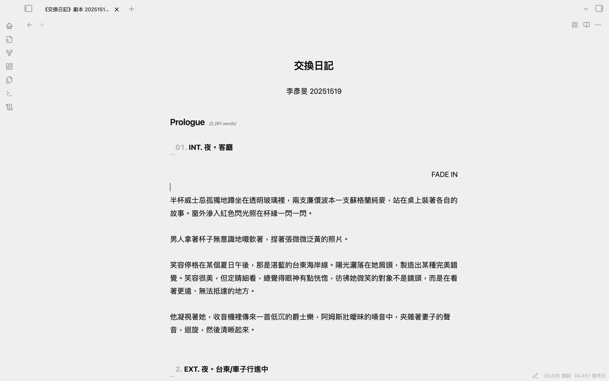
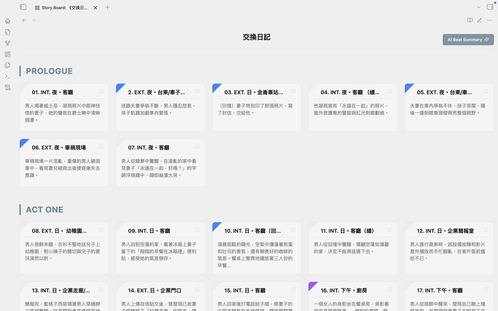
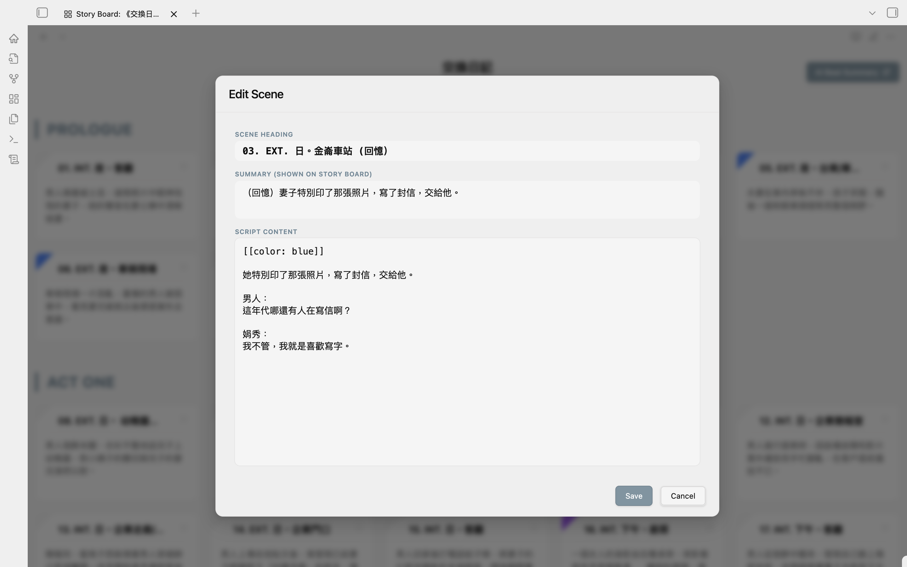
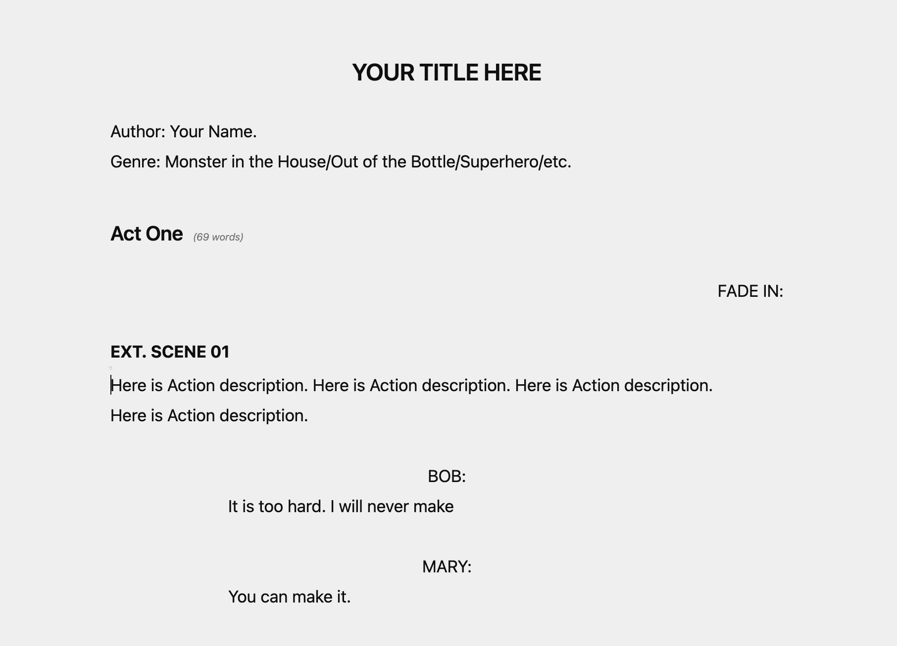

# Script Editor v1.9

Script Editor is an AI Powered Fountain-compatible screenplay editor with CJK support (Chinese, Japanese, Korean), intelligent formatting detection, integrated Story Board/Outline tools, AI aid summary, and DOCX export.

[繁體中文版本](./README_tw.md)

<table width="100%">
  <tr>
    <td width="33%" align="center">
       
      <b>Editor Mode</b>
    </td>
    <td width="33%" align="center">
       
      <b>Story Board Mode</b>
    </td>
    <td width="33%" align="center">
       
      <b>Card Editor</b>
    </td>
  </tr>
</table>

## 📝 Syntax Guide

Use standard [Fountain Syntax](https://fountain.io/syntax/).

- **Scene Heading**: 'INT. / EXT.' will automatically be bolded and uppercased.
- **Character**: '@NAME', 'NAME', or 'NAME:' will be centered. The "@" is hidden in preview.
- **Dialogue**: Text below a Character will be automatically indented.
- **Parenthetical**: '(emotion)', 'OS:', or 'VO:' will be automatically centered and italicized.
- **Transition**: 'CUT TO:' or 'FADE IN' will be right-aligned.

## 🛠️ Features

### Fast Script Creation

This plugin does not affect other .md files. You can create new .md files pre-configured with the correct metadata (`cssclasses: fountain`).

- **Context Menu**: Right-click on any folder and select **New script**.
- **Command Palette**: Search for `Create new script`.

### Story Board Mode

A visual grid view of your screenplay's scenes with full drag-and-drop support.

- **Access**: Click the "Grid" icon (⊞) in the view header.
- **Drag & Drop Reordering**: Rearrange scenes by dragging cards between positions. A blue insertion line guides you for precise placement.
- **Quick Navigation**: Click any card to instantly jump to that scene in the editor.
- **Color Tag**: Click the top-left corner to set card color markers.
- **Card Function**: Click the top-right icon to add, clone, delete cards, or generate scene summaries with AI.
- **Act Grouping**: Scenes are automatically grouped under `##` (H2) headings (Acts).

### AI Powered Features

- In **Story Board Mode**, you can use AI aid for summaries. You need to enter your Gemini API Key in the settings page first.
- **AI Beat Summary**: Integrates Gemini 2.5 Flash to instantly generate scene summaries or new scenes based on context.
- **Bulk AI Processing**: One-click to analyze and summarize your entire screenplay.
- **AI Rewrite Scene**: Right-click anywhere in the editor to rewrite your rough notes into a professional screenplay scene based on surrounding context.

### DOCX Export

Industry-standard screenplay documents.

- **Editor/File Explorer**: Right-click -> **Export to .docx**.

### Scene Renumbering

- **Command Palette**: `Scripter: Renumber Scenes`
- Automatically updates sequential numbers for all Scene Headings (e.g., `01. INT. ...`).

### Character Suggestion Menu

Quickly insert character names with frequency-based autocomplete.

- **Trigger**: Type `@` anywhere in your script.
- **Smart Ranking**: Characters are ranked by how often they appear in your script.
- **Automatic Detection**: Works with `@NAME`, `NAME:`, and ALL-CAPS formats.

### Export Summary

Export your script's structure to a separate Markdown file.

- **Editor/File Explorer**: Right-click -> **Export summary**.
- Outputs all H1, H2 headings and scene summaries to a new `.md` file.

### Right-click Function

- In editing mode, the right-click menu provides common Syntax options and other functions.

### Markdown-Native

A hybrid design that respects standard Markdown (Headings, Lists, Bold) while delivering professional screenplay formatting.

---

## 📦 Installation

We recommend using **BRAT** or manual installation.

### Manual Installation

1. Download `main.js`, `manifest.json`, and `styles.css` from the [Latest Release](https://github.com/ideo2004-afk/script-editor-obsidian/releases/latest).
2. Create a folder named `script-editor` in your vault's `.obsidian/plugins/` directory.
3. Copy the downloaded files into that folder.
4. Reload Obsidian.

---

## Support

Created by Yan Min Lee ( ideo2004@gmail.com ). I am a movie director and scriptwriter in Taiwan. If you find this plugin useful and would like to support its development, please consider buying me a coffee:

## License

MIT
